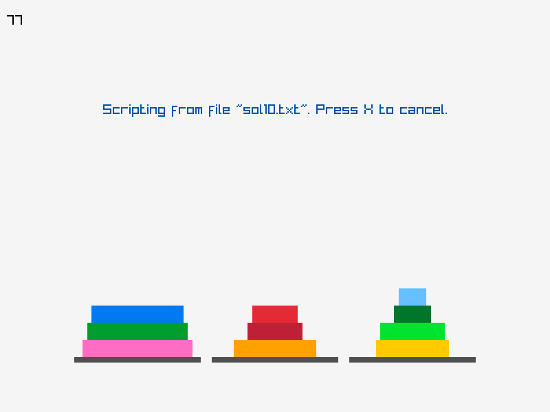

# Fortran Hanoi Towers

A classic puzzle of Hanoi Towers coded using Fortran.



## Installation

### 1 Install Raylib library

Download, build and install raylib library using instructions from here:
- https://github.com/raysan5/raylib/wiki/Working-on-GNU-Linux

Installing dependecies:
```sh
$ sudo dnf install alsa-lib-devel mesa-libGL-devel libX11-devel libXrandr-devel libXi-devel libXcursor-devel libXinerama-devel libatomic
```

Buliding raylib:
```sh
$ git clone --depth 1 https://github.com/raysan5/raylib.git raylib
$ cd raylib/src/
$ make PLATFORM=PLATFORM_DESKTOP # To make the static version.
$ sudo make install # Static version
```

Testing the installation
```
$ cd raylib/examples
$ make PLATFORM=PLATFORM_DESKTOP
```

### 2 Download and compile Fortran bindings with raylib

- https://github.com/interkosmos/fortran-raylib
```sh
$ git clone --depth 1 https://github.com/interkosmos/fortran-raylib
$ cd fortran-raylib
$ make
```

### 3 Tune the build script to your needs

In `build.sh` or `build.bat` set the path to the directory containing `fortran-raylib`
code.

### 4 Compile and run the game

```sh
$ ./build.sh
$ ./hanoi
```

or in Windows

```sh
$ ./build.bat
$ ./hanoi.exe
```

## Instructions

- Use the left mouse button to move rings between columns (Click to select the base from which a segment is moved, and then click again to select the destination base.)
- Press a number key ('1', '2', etc.) to restart the puzzle with the corresponding number of rings.
- Press 'Z' to toggle animation style; press '+' or '-' to increase or
decrease the animation (and the script replay) speed.
- Press 'A', then drag and drop a script file containing move instructions onto the window

### Script file

Below is an example of a script file:

```
3
1 3
1 2
3 2
1 3
2 1
2 3
1 3
```

The number on the first line specifies the number of rings. Each subsequent
line describes a single move. For example, `1 3` instructs the program
to move the top ring from the
leftmost base (1) to the rightmost base (3).
